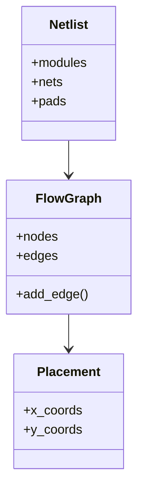
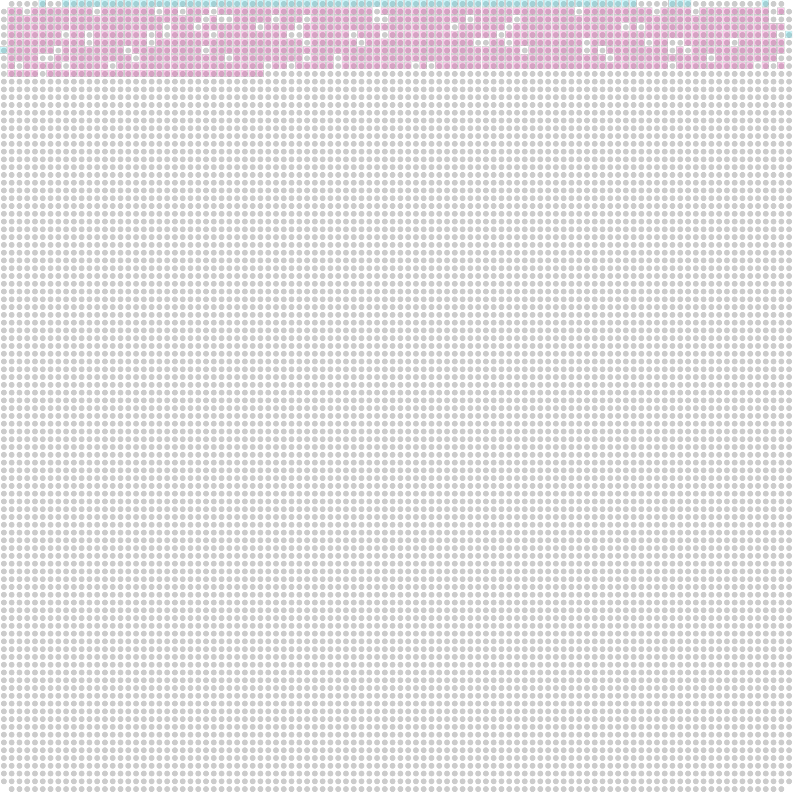
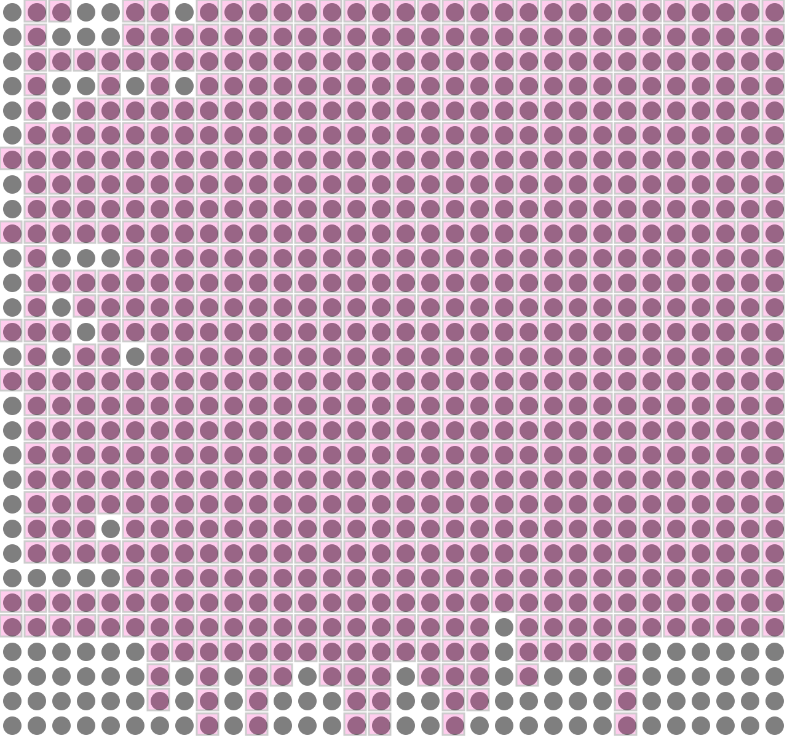
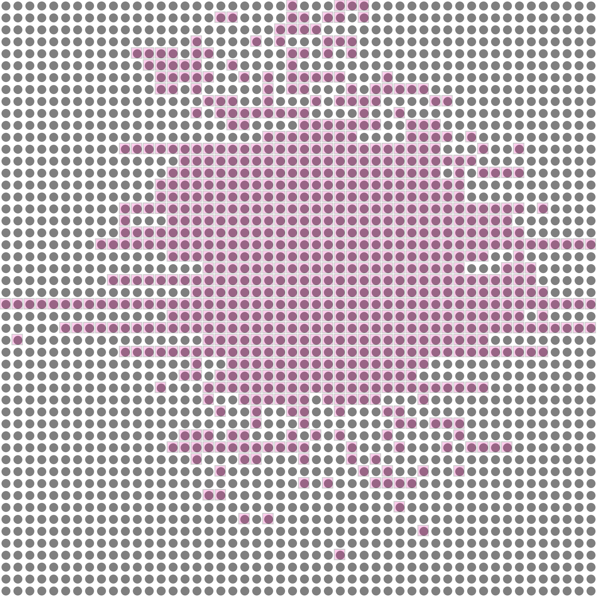

# Fairness-Centric Global Placement Algorithm 🎯

## Title Slide

### Title: Fairness-Centric Global Placement Algorithm ⚖️
### Speaker: [Your Name] 🎤
### Date: [Today's Date] 📅

*   **What is Global Placement?** Arranging circuit components (modules) on a grid. 🧩
*   **Goal:** Optimize the placement to minimize wire lengths. 📉
*   **Focus:** Minimizing the **worst wire length**. 🎯
*   **Approach:** An iterative, fairness-centric method using Howard's algorithm and bipartite matching. 🔄

---

## The Problem: Global Placement 🧩

*   **FPGA:** Field-Programmable Gate Array - a chip whose logic can be configured after manufacturing. 💻
*   **Placement:** The step in electronic circuit design where logical components (modules like logic gates, flip-flops, DSPs, SRAMs, I/O pads) are assigned physical locations on the FPGA grid. 📍
*   **Netlist:** Input describing modules and their connections (wires). 📋
*   **Grid:** The physical layout area on the FPGA where modules can be placed. 🟦
*   **Why is it hard?** Many components, complex interconnections, physical constraints (grid size, dedicated blocks, I/O locations), and the need to minimize wire length for performance and routability. 🤯

---

## Placement Goals 🎯

*   **Primary Goal:** Minimize the **worst wire length**. 📉
*   *Why worst wire length?* Long wires (high worst wire length) can cause timing violations and make routing impossible. Minimizing the *worst* case contributes to fairness, ensuring no single connection is excessively long. ⚖️
*   **Other Metrics:** Total Half Perimeter Wirelength (HPWL) (though sources suggest worst wirelength is the primary focus for this algorithm). 📏
*   **Constraints:** Modules must not overlap, must respect grid boundaries and dedicated areas (like column 27 for DSP/SRAM). 🚧

---

## Algorithm Overview: Fairness-Centric Approach 🔄

*   The algorithm is referred to as "fairness-centric" (NNS). ⚖️
*   It iteratively improves placement. 🔄
*   Key steps:
    1.  Create a flow graph from the netlist. 📊
    2.  Generate an initial random placement. 🎲
    3.  Repeatedly apply optimization steps (Howard's algorithm) along X and Y axes. 📈
    4.  Legalize the placement to fix overlaps and constraints. ⚖️
    5.  Assign I/O pads to grid edges. 📍
    6.  Continue until satisfactory placement or max iterations reached. 🔁
*   Analogy: "Arranging puzzle pieces (circuit modules) on a board (the grid) in a way that minimizes the total length of strings (wires) connecting related pieces, while making sure all pieces fit within the board's boundaries." 🧩 (Note: The primary goal is minimizing the *worst* wire, not necessarily the total length in this specific implementation description, although minimizing worst often helps total).

---

## Data Structures & Libraries 📚



---

## Data Structures & Libraries 📚

*   **Netlist:** Description of circuit components and connections. Handled by the `netlistx.netlist` module. Contains modules, nets, pads. 📋
*   **Flow Graph:** Represents connections between modules, derived from the netlist. Can use `TinyDiGraph` or `nx.DiGraph` (NetworkX). Edges are added bidirectionally between connected modules. 📊
*   **Placement Representation:** A 2D list (`place`) where `place` stores x-coordinates and `place` stores y-coordinates for each module. 📍
*   **Counts/Limits:** Lists (`self.count`, `self.limit`) to track the number of modules in each row/column and the maximum allowed. Includes space for I/O rows/columns. �
*   **Grid Configuration:** Handled by `NnsConfig` (`self.cfg`), defines grid size (`cfg.grid`) and cost scaling factors (`cfg.delta`). ⚙️
*   **Physical Design Primitives:** Uses `physdes` library for geometric objects like `Interval`, `Point`, `Rect`. 📐

---

## Initial Placement 🎲

*   A starting point is generated randomly. 🎰
*   Modules are assigned column and row indices within the grid boundaries. 📍
*   A list of modules (`lst`) is shuffled, and then each module is assigned an (x, y) coordinate incrementally across rows. 🔀
*   Counts for modules in each row/column are updated. 🔢
*   Special handling for column 27, which is assumed to be preserved for DSP or SRAM and skipped during this phase. ⚠️
*   Assertions check against column 27 being used and limits being exceeded initially. ✅



---

## Core Optimization: Howard's Algorithm 📈

*   Applied along each axis (X then Y, or vice-versa). ↔️
*   The `apply_howard` function uses `min_parametric` from `digraphx.min_parametric_q`. 🔢
*   This involves finding the minimum ratio in a directed graph. 📉
*   Howard's algorithm is a minimum cycle ratio solver often used in combination with negative cycle finding. 🔄
*   It iteratively adjusts distances/positions based on edge weights derived from costs. ⚖️
*   The cost for an edge (connection) along one axis depends on the positions of the connected modules along the *opposite* axis, scaled by `self.cfg.delta`. 📊

---

## Cost Function & Worst Wirelength 📉

*   **Cost Function:** Calculates the cost of a distance based on the axis.
    $$
    \text{cost}(\text{length}, \text{axis}) = \text{length} \times \text{self.cfg.delta}[\text{axis}]
    $$ 💰

*   `self.cfg.delta[axis]` are configuration parameters that scale costs differently for X and Y axes. ⚖️

*   **Worst Wirelength Calculation:** Finds the maximum cost among all connections in the graph based on the Manhattan distance between connected modules.
    $$
    \text{wirelength}(u, v) = \text{cost}(|\text{place}[v] - \text{place}[u]|, 0) + \text{cost}(|\text{place}[v] - \text{place}[u]|, 1)
    $$

*   The algorithm aims to minimize `max(wirelength(u, v))` over all connected (u, v) pairs. 🎯

---

## Placement Legalization ⚖️

*   Ensures modules do not overlap and respect grid constraints. 🚧
*   Uses **bipartite matching**. ↔️
*   The `legalize` function constructs a bipartite graph. 📊
*   One set of nodes in the bipartite graph represents the modules to be legalized (`lst`). 🅰️
*   The other set represents potential new positions for these modules, often based on their current positions shifted by a certain neighborhood. 🅱️
*   Edges connect modules to potential new positions, with weights representing the change in worst wirelength for that module if moved. ⚖️
*   `bipartite.minimum_weight_full_matching` is used to find an assignment of modules to new positions that minimizes the total change in worst wirelength within the neighborhood. 🔍
*   If no match is found, the neighborhood size is increased. 🔎
*   Positions and row/column counts (`self.count`) are updated based on the matching results. 🔢
*   `legalize_modules` applies this process to modules, grouping them into buckets based on their coordinate on the *opposite* axis. 🪣



---

## I/O Pad Assignment 📍

*   I/O pads are assigned to the edges of the grid. 🏁
*   The `io_assign` function orchestrates this. 🎼
*   `choose_nearest_iopad` selects the nearest grid edge (0 or grid+1) for each I/O pad. 📍
*   This choice is based on minimizing the *worst-case distance* to connected modules, considering both X and Y options and available space (`self.count`) along the edges. 📏
*   After choosing edges, `legalize_iopad` potentially adjusts positions of pads already assigned to an edge using the `legalize` function (though the source comments suggest the `legalize` call within `legalize_iopad` operates on the *opposite* axis from the edge axis, which seems counter-intuitive - needs careful reading). 🤔
*   Grid edges for I/O: Row 0, Row `grid_y`+1, Column 0, Column `grid_x`+1. 📍
*   I/O pads are treated differently from standard modules (`num_pads`). ⚠️

---

## Iterative Optimization Loop 🔄

*   The core optimization process is run iteratively. 🔁
*   The `optimize` function performs one full step. ▶️
*   Inside the loop:
    1.  Apply Howard's algorithm on X-axis. ↔️
    2.  Legalize modules (possibly along Y-axis based on bucket logic?). ⚖️
    3.  Choose/assign I/O pads. 📍
    4.  Apply Howard's algorithm on Y-axis. ↕️
    5.  Legalize modules (possibly along X-axis?). ⚖️
    6.  Choose/assign I/O pads again. 📍
*   The `run` function executes the `optimize` loop for `max_iters`. 🔢
*   The algorithm keeps track of the best placement found so far (lowest worst wirelength). 🏆
*   Stopping criteria mentioned: "until no further improvement is possible" or "a specified number of iterations", implemented by checking if the worst wirelength increased in an iteration. If it increased, the placement is reverted to the previous best. ⏹️



---

## Key Algorithms Summary 📚

*   **Howard's Algorithm:** Used within `min_parametric` to optimize positions along an axis by solving a minimum ratio problem. Based on finding negative cycles in a graph. 🔄
*   **Parametric Minimum Cost Flow:** `digraphx.min_parametric` solves a specific network optimization problem parameterized by a ratio. Used to find the placement along an axis that satisfies constraints for a given 'radius' (related to wirelength). 📊
*   **Negative Cycle Finder:** `digraphx.neg_cycle_q` (or similar, based on Howard/Bellman-Ford) detects cycles where the sum of edge weights is negative, used in minimum ratio or parametric problems. 🔍
*   **Bipartite Matching:** Used in `legalize` to reassign module positions based on finding a minimum weight match between modules and potential grid locations. Solved using NetworkX's `minimum_weight_full_matching`. ↔️
*   **Geometric Primitives:** `physdes` library for handling points, intervals, and rectangles simplifies calculations like distances (`min_dist`), containment (`contains`), and bounding boxes (`hull_with`, `length`, `width`, `height`) for wirelength estimations. 📐

---

## `digraphx` Usage Example 💻

*   The `apply_howard` function calls `min_parametric`. 📞
*   `min_parametric` takes the flow graph (`self.gr`), an initial ratio (`Fraction(worst)`), functions to calculate edge weight (`calc_weight`) and zero cancellation (`zero_cancel`), the placement on the current axis (`place[axis]`), and an update check function (`update_ok`). 📋
*   `calc_weight` uses the current beta (ratio) and edge cost to compute a weight. ⚖️
*   `zero_cancel` calculates the ratio for a cycle based on total cost and cycle length. 🔄
*   `update_ok` checks if moving a module to a new position is valid (e.g., not outside grid, not exceeding row/column limits) before updating the internal counts (`self.count`). ✅

---

## `netlistx` and `physdes` Usage 📚

*   `netlistx.Netlist`: Represents the input circuit netlist, providing access to modules, nets, and counts. Used during initialization to build the flow graph and in various calculations involving nets. 📋
*   `physdes.Interval`: Represents a range. Used in `calc_total_hull_length` to compute the bounding box (hull) of net connections along an axis and its length. 📏
*   `physdes.Point`: Represents a coordinate in 2D space. Used in commented-out `calc_total_hpwl` for calculating bounding boxes. 📍
*   `physdes.Rect`: Represents an axis-aligned rectangle. Used in commented-out `calc_total_hpwl` for bounding boxes. 🟦
*   These geometric objects and their methods like `hull_with` and `length` simplify physical design calculations. 🧮

---

## Core Algorithms in Detail

---

### Parametric Search and Howard's Algorithm

The core of the optimization is a parametric search implemented in the `min_parametric` function. This function is a generalization of Howard's algorithm for finding the minimum cycle ratio in a graph.

**Problem Formulation:**

The placement problem is formulated as a search for the minimum `ratio` (worst wirelength) such that there exists a placement `dist` that satisfies the following constraints for all connections `(u, v)`:

`dist[v] - dist[u] <= cost(u, v, ratio)`

**Algorithm:**

1.  **Initialization**: Start with an initial `ratio` (e.g., the worst wirelength of the initial placement).
2.  **Weight Calculation**: For the given `ratio`, calculate the weight of each edge in the graph using the `calc_weight` function.
3.  **Negative Cycle Detection**: Use a negative cycle finder (`NegCycleFinder`) to find negative cycles in the graph. The `find_neg_cycle_succ` and `find_neg_cycle_pred` methods are used, which are based on the Bellman-Ford algorithm.
4.  **Ratio Update**: If a negative cycle is found, it means the current `ratio` is too high. The `zero_cancel` function calculates a new, smaller `ratio` based on the cycle.
5.  **Iteration**: Repeat steps 2-4 until no negative cycles are found, which means the optimal `ratio` for the current placement has been reached.

The `apply_howard` function in `placement.py` orchestrates this process for each axis.

---

### Bipartite Matching for Legalization

After each optimization step, the placement needs to be "legalized" to ensure that no two modules occupy the same grid location. This is done using a minimum weight bipartite matching algorithm.

**Algorithm:**

1.  **Graph Construction**: For each row or column, a bipartite graph `B` is constructed.
    *   One set of nodes represents the modules in that row/column.
    *   The other set of nodes represents the available grid locations.
2.  **Edge Weights**: An edge is added between a module and a potential location with a weight equal to the change in the worst wirelength if the module is moved to that location.
3.  **Matching**: The `bipartite.minimum_weight_full_matching` function from `networkx` is used to find a perfect matching with the minimum total weight. This matching represents the optimal assignment of modules to locations that minimizes the impact on the wirelength.
4.  **Placement Update**: The placement is updated based on the matching result.

This process is implemented in the `legalize` function in `placement.py`.

---

### Placement Flow

The overall placement flow can be visualized as follows:

```mermaid
graph TD
    A[Start] --> B{Initial Random Placement};
    B --> C{Iterative Optimization};
    C --> D{Apply Howard's Algorithm (X-axis)};
    D --> E{Legalize Placement (Y-axis)};
    E --> F{Assign I/O Pads};
    F --> G{Apply Howard's Algorithm (Y-axis)};
    G --> H{Legalize Placement (X-axis)};
    H --> I{Assign I/O Pads};
    I --> J{Check for Improvement};
    J -- No Improvement --> K[End];
    J -- Improvement --> C;
```

---

## Summary & Conclusion 📝

*   The Fairness-Centric Global Placement Algorithm (NNS) aims to minimize the **worst wire length**. 🎯
*   It uses an iterative process involving:
    *   Initial random placement. 🎲
    *   Applying Howard's algorithm along each axis for optimization. 📈
    *   Legalizing placement using bipartite matching to resolve conflicts. ⚖️
    *   Assigning I/O pads to the periphery. 📍
*   Leverages specific libraries: `netlistx` for netlist representation, `digraphx` for graph algorithms (parametric min-cost flow, negative cycles), and `physdes` for geometric calculations. 📚
*   The core optimization relies on `min_parametric`, which uses concepts from minimum ratio cycle problems and negative cycle finding. 🔄
*   Legalization is handled efficiently using minimum weight bipartite matching. ↔️
*   The process iterates, tracking the best placement by monitoring the worst wirelength. 🔍
*   This approach provides a structured way to optimize Global placement with a focus on ensuring fairness by bounding the maximum wire length. ✨

---

## Questions? 🤔
