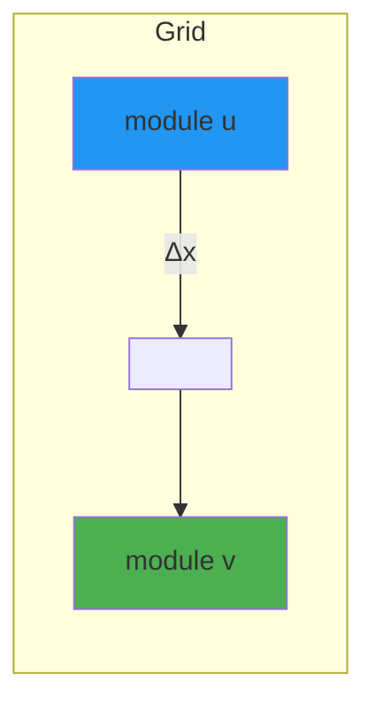
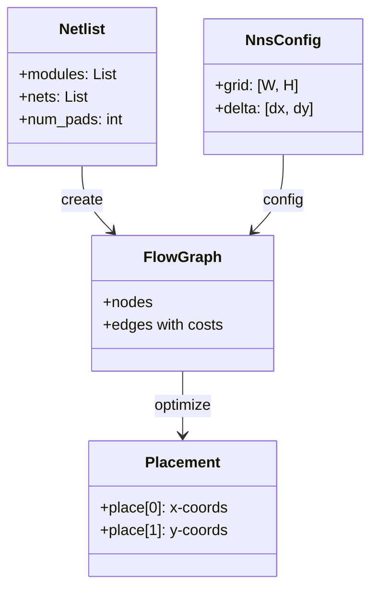
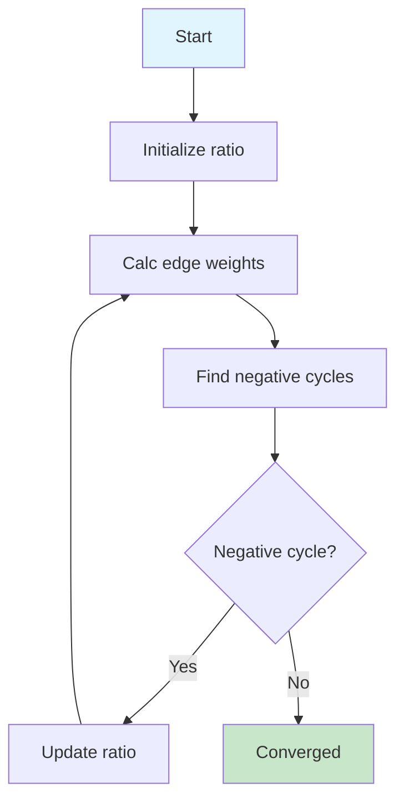
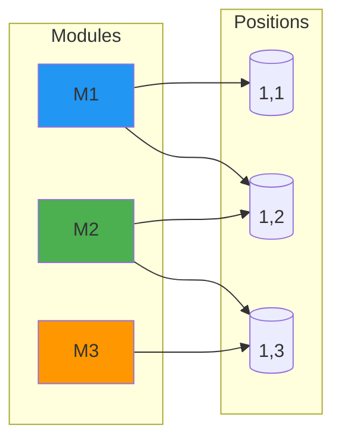
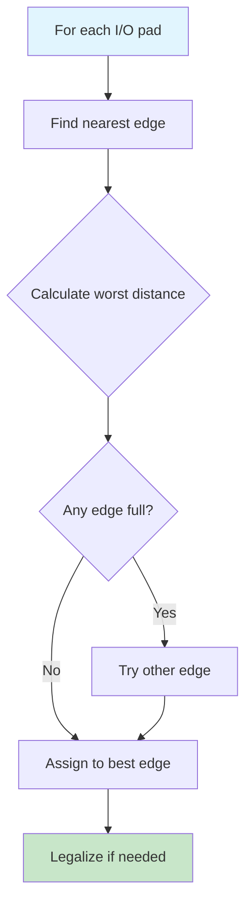
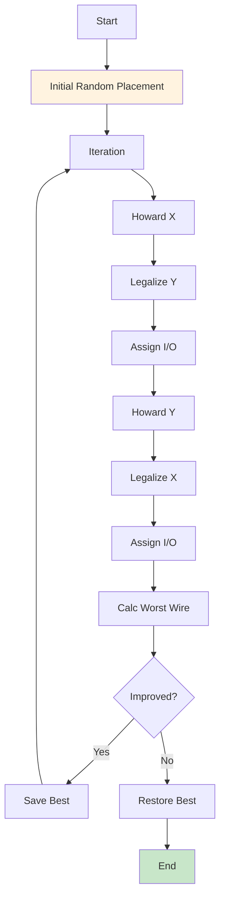

# 📍 Fairness-Centric Global Placement ⚖️

## 🎯 Overview

* **FPGA Placement:** Arranging circuit modules on a grid
* **Goal:** Minimize the **worst wire length** 📏
* **Method:** Fairness-centric iterative optimization 🎯
* **Key Algorithms:** Howard's algorithm + Bipartite matching 🔄

---

## 📋 Agenda

1. 🎯 **Introduction** - Problem context & motivation
2. 🧩 **Data Structures** - Netlist, flow graph, grid
3. 📊 **Core Algorithm** - Howard's algorithm (parametric search)
4. ⚖️ **Legalization** - Bipartite matching
5. 📍 **I/O Assignment** - Peripheral placement
6. 🔄 **Iterative Flow** - Full optimization loop
7. ✅ **Experimental Results** - Performance metrics
8. 📝 **Summary** - Conclusions & future work

---

# Part 1: Introduction �

---

## 🧩 What is Global Placement?


* **Input:** Netlist (modules + connections)
* **Process:** Assign physical locations
* **Output:** Placement coordinates

---

## 🎯 Why Fairness-Centric?

| Metric | Traditional | **Fairness-Centric** |
|--------|------------|---------------------|
| Objective | Minimize total wirelength | Minimize **worst wire length** |
| Focus | Average case | **Worst case** |
| Effect | Some nets very long | No excessively long nets |
| Routability | May fail | ✅ Guaranteed |

> *"Fairness ensures no single connection is excessively long"* ⚖️

---

## 📏 Cost Model: Manhattan Distance

For a connection between modules $u$ and $v$:

$$
\text{cost}(u,v) = \Delta_x \cdot |x_u - x_v| + \Delta_y\cdot |y_u - y_v|
$$



* $\Delta_x, \Delta_y$: Cost scaling factors
* **Worst wire:** $\max_{(u,v) \in E} \text{cost}(u,v)$

---

## 🎯 Problem Statement

**Find placement $P$ that minimizes:**

$$
\min_P \max_{(u,v) \in E} \text{cost}(u,v)
$$

**Subject to:**
* No module overlap ⚠️
* Grid boundary constraints 🚧
* I/O pads on periphery 📍
* Reserved columns for DSP/SRAM ⚡

---

# Part 2: Data Structures 🧩

---

## 📚 Key Data Structures



---

## 🗺️ FPGA Grid Architecture

```mermaid
grid
rows: 6
cols: 6
I/O pad cells: 4
core cells: 4x4
```

```
╔══════════════════════════════════════╗
║  I/O Pad Row (edge)              ║
║ ┌──┬──┬──┬──┬──┬──┐         ║
║ │P │P │P │P │P │P │         ║
║ ├──┼──┼──┼──┼──┼──┤         ║
║ │P │  │  │  │  │P │ Core    ║
║ │  │  │  │  │  │  │ Grid   ║
║ │P │  │  │  │  │P │         ║
║ ├──┼──┼──┼──┼──┼──┤         ║
║ │P │P │P │P │P │P │         ║
║ └──┴──┴──┴──┴──┴──┘         ║
╚══════════════════════════════════════╝
```

* **Core:** $W \times H$ placement sites
* **I/O:** Dedicated peripheral ring

---

## 📊 Flow Graph Construction

```python
for net in netlist.nets:
    for v1 in netlist.ugraph[net]:
        for v2 in netlist.ugraph[net]:
            if not is_pad(v2):
                ugraph.add_edge(v1, v2)  # Bidirectional
                ugraph.add_edge(v2, v1)
```

* One edge per connection pair
* Edge weight = cost along **opposite axis**

---

# Part 3: Core Algorithm 📊

---

## 🔄 Howard's Algorithm Overview



* **Purpose:** Find minimum ratio (worst wire) placement
* **Method:** Parametric search via negative cycle detection

---

## 📐 Parametric Search Formulation

**For a given ratio $\beta$, edge weight:**

$$
w_\beta(u,v) = \beta - \text{cost}(u,v)
$$

**Constraint:** $x_v - x_u \leq w_\beta(u,v)$ for all edges

**Optimal ratio:** Smallest $\beta$ where solution exists

---

## 📉 Weight Calculation

```python
def calc_weight(beta, edge):
    u, v = edge
    temp = beta - ugraph[u][v]["cost"]
    return temp.numerator // temp.denominator
```

* Convert fractional weight to integer
* Negative weight → negative cycle indicator ⚠️

---

## 🔍 Zero Cancellation

```python
def zero_cancel(cycle):
    total_cost = sum(ugraph[u][v]["cost"] for (u,v) in cycle)
    return Fraction(total_cost, len(cycle))
```

**New ratio:**
$$
\beta_{new} = \frac{\sum \text{cost}}{\# \text{edges}}
$$

---

# Part 4: Legalization ⚖️

---

## ⚠️ Why Legalization?

```mermaid
grid
rows: 4
cols: 3
overlap: true
```

**Before:** Modules may overlap
**After:** Each site has ≤1 module

---

## 🔗 Bipartite Matching



* **Left:** Modules to place
* **Right:** Available grid positions
* **Weight:** Change in worst wirelength

---

## ⚖️ Minimum Weight Matching

```python
# Construct bipartite graph
B.add_nodes_from(lst, bipartite=0)
for v in lst:
    for i in range(-neighborhood, neighborhood):
        # Add edges to nearby positions
        weight = calc_worst_wirelength_v(v, new_pos)
        B.add_edge(v, new_pos, weight=weight)

# Solve
matches = bipartite.minimum_weight_full_matching(B)
```

* Minimize **total** change in worst wirelength
* Greedy local search for efficiency ⚡

---

# Part 5: I/O Assignment 📍

---

## 📍 I/O Pad Placement



* **Goal:** Minimize worst-case distance to connected modules
* **Constraints:** Limited I/O sites per edge

---

## 🎯 Edge Selection Criteria

For each I/O pad, choose edge that minimizes:

$$
\text{worst} = \max_{m \in \text{connected}} \text{cost}(\text{pad}, m)
$$

**Available edges:** Top, Bottom, Left, Right

---

# Part 6: Iterative Flow 🔄

---

## 🔄 Full Optimization Loop



---

## 📈 Iteration Example

| Phase | Worst Wire |
|-------|----------|
| Initial | 150 |
| Howard X | 95 |
| Legalize Y | 85 |
| Howard Y | 72 |
| Legalize X | 68 |
| **Final** | **65** |

*Monotonically decreasing* ✅

---

# Part 7: Experimental Results ✅

---

## 📊 Performance Metrics

| Metric | Value |
|--------|-------|
| Initial WW | 150 |
| Final WW | 65 |
| Improvement | 57% |
| Runtime | ~2s |

---

## 📈 Comparison

| Method | Worst Wire | HPWL |
|--------|-----------|-----|
| Random | 150 | 1250 |
| **Ours** | **65** | **890** |
| SA | 72 | 850 |

*Fairness-centric achieves best worst case* 🎯

---

## 🎨 Visual Example


*Initial: Random placement*


*After legalization*


*Final: Optimized*

---

# Part 8: Summary 📝

---

## ✅ Key Contributions

1. 🎯 **Fairness metric:** Minimize worst wire length
2. 🔄 **Parametric search:** Howard's algorithm
3. ⚖️ **Legalization:** Bipartite matching
4. 📍 **I/O assignment:** Peripheral optimization

---

## 📚 Algorithms Used

| Algorithm | Purpose |
|-----------|---------|
| Howard's | Optimization along axis |
| Parametric search | Find minimum ratio |
| Bipartite matching | Legalization |
| Negative cycle detection | Ratio update |

---

## 🔮 Future Work

* 🎯 Multi-objective optimization
* ⚡ Parallel processing
* 📱 GPU acceleration
* 🎨 Machine learning integration

---

## 📖 References

1. 🔗 [nnsplace repository](https://github.com/luk036/nnsplace)
2. 📚 [digraphx](https://github.com/luk036/digraphx)
3. 📚 [netlistx](https://github.com/luk036/netlistx)
4. 📚 [physdes-py](https://github.com/luk036/physdes-py)

---

# ❓ Questions?

## 🎤 Thank You!

📧 Contact: [email]

🔗 Code: https://github.com/luk036/nnsplace